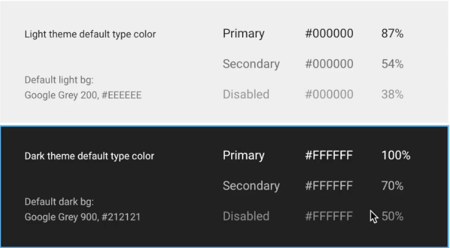

# Android Cheat Sheet 


#### In Intent there must be a app to handle this rquest


```  
if(intent.resolveActivity(getActivity().getPackageManager())!=null){
       startActivity(intent);
    }
    
```

#### For complete scroll of card in recycler view

``` 
    SnapHelper snapHelper = new StartSnapHelper();
    snapHelper.attachToRecyclerView(binding.recyclerView);
```


#### In Rotation Data remain Same

``` 
     android:configChanges="orientation|keyboardHidden|screenSize"
```


#### For animation in visible and invisible layout

apply to those layout for which layout length gets changes

```
    android:animateLayoutChanges="true"
```

#### For touch effect
```
           android:foreground="?android:attr/selectableItemBackground"
```

#### To create Edittext mulitiline put this in edittext
```
android:inputType="textMultiLine"
//put this in mainfeast > > activity

```

#### Delay Timer
```
    void delayFragmentClosing(){

        new Handler().postDelayed(new Runnable(){
            @Override
            public void run() {
                /* put code that will implemented after 2 sec */
              closeFragment();
            }
        }, 2000);
    }

```

#### Rs sign 

```
<string name="Rs">\u20B9</string>

```

#### Encrypt and Decrypt Strings

```
    public static String encrypt(String input) {
        // This is base64 encoding, which is not an encryption
        return Base64.encodeToString(input.getBytes(), Base64.DEFAULT);
    }

    public static String decrypt(String input) {
        return new String(Base64.decode(input, Base64.DEFAULT));
    }


```


#### For expandable view
  ```  
     <at.blogc.android.views.ExpandableTextView
                       android:id="@+id/comment"
                       android:layout_marginStart="@dimen/_4sdp"
                       android:layout_width="match_parent"
                       android:layout_height="wrap_content"
                       android:layout_centerVertical="true"
                       android:layout_toEndOf="@id/iconAttachmentFile"
                       android:clickable="true"
                       android:ellipsize="end"
                       android:maxLines="2"
                       android:onClick="@{model::resizeText}"
                       android:text="@{model.description}"
                       android:textSize="@dimen/_10sdp"
                       app:animation_duration="600"
    
    
                       />

now from code

    binding.comment.toggle();//to expand and collapse

```


#### on implements Obervable

```  
       // FROM BASE OBSERVABLE
        @Ignore
        private transient PropertyChangeRegistry mCallbacks;
        @Override
        public void addOnPropertyChangedCallback(OnPropertyChangedCallback onPropertyChangedCallback) {
           if (mCallbacks == null) {
               mCallbacks = new PropertyChangeRegistry();
           }
           mCallbacks.add(onPropertyChangedCallback);
        }
    
        @Override
        public void removeOnPropertyChangedCallback(OnPropertyChangedCallback onPropertyChangedCallback) {
          if (mCallbacks != null) {
            mCallbacks.remove(onPropertyChangedCallback);
          }
    
       }
    
       public void notifyPropertyChanged(int fieldId) {
           if (mCallbacks != null) {
               mCallbacks.notifyCallbacks(this, fieldId, null);
           }
       }

```


#### Change the color of progressbar from xml

```
    <ProgressBar
                   android:indeterminate="true"
                   android:indeterminateTint="@color/white"
                   android:elevation="@dimen/_8sdp"
                   android:id="@+id/saveProgressBar"
                   android:layout_width="@dimen/_24sdp"
                   android:layout_height="@dimen/_24sdp"
                   android:layout_alignParentRight="true"
                   android:layout_marginEnd="@dimen/_12sdp"
                   android:layout_below="@+id/coverImage"
                   />

```


#### Gender spinner Selector

```
    setupPopupMenu(constantUnit.getShow(),view).setOnMenuItemClickListener(item -> {
       view.setText(item.getTitle());
       userSpecificDetails.setGender(constantUnit.getServer().get(constantUnit.getServer().indexOf(item.getTitle().toString())));
       return false;
    });


    PopupMenu setupPopupMenu(List<String> array , View view ){
       PopupMenu popup = new PopupMenu(getContext(), view);
       for (String s : array)
       {
           popup.getMenu().add(s);
       }
       popup.show();
       return popup;
    }


    <android.support.design.widget.TextInputLayout
       android:id="@+id/profile_gender_container"
       android:layout_width="match_parent"
       android:layout_height="wrap_content"
       android:layout_marginEnd="@dimen/_16sdp"
       android:layout_marginStart="@dimen/_16sdp"
       foo:hintTextAppearance="@style/MyHintLayout">

       <EditText
           android:id="@+id/profile_gender"
           android:layout_width="match_parent"
           android:layout_height="wrap_content"
           android:backgroundTint="@color/grey_patient_background"
           android:editable="false"
           android:ellipsize="end"
           android:enabled="@{editor.makeEditable ? true : false}"
           android:focusable="false"
           android:focusableInTouchMode="false"
           android:hint="Gender"
           android:inputType="textAutoComplete|textCapSentences"
           android:longClickable="false"
           android:text="@{model.gender}"
           android:textSize="@dimen/_12sdp" />
    </android.support.design.widget.TextInputLayout>

```


#### Date

```
    import android.text.format.DateFormat;
    String dayOfTheWeek = (String) DateFormat.format("EEEE", date); // Thursday 
    String day = (String) DateFormat.format("dd", date); // 20
    String monthString = (String) DateFormat.format("MMM", date); // Jun 
    String monthNumber = (String) DateFormat.format("MM", date); // 06 
    String year = (String) DateFormat.format("yyyy", date); // 2013

```

#### Add Event to Google Calender

```
    public void addEvent( String title, String description, long startTime,
                         long endTime) {
       try {
           ContentResolver cr = getActivity().getContentResolver();
           ContentValues values = new ContentValues();
           values.put(CalendarContract.Events.DTSTART, startTime);
           values.put(CalendarContract.Events.DTEND, endTime);
           values.put(CalendarContract.Events.TITLE, title);
           values.put(CalendarContract.Events.DESCRIPTION, description);
           values.put(CalendarContract.Events.CALENDAR_ID, 1);
           values.put(CalendarContract.Events.HAS_ALARM,1);// 0 for false, 1 for true
           values.put(CalendarContract.Events.EVENT_TIMEZONE, Calendar.getInstance().getTimeZone().getID());
           if (ActivityCompat.checkSelfPermission(getActivity(), Manifest.permission.WRITE_CALENDAR) != PackageManager.PERMISSION_GRANTED) {
               // TODO: Consider calling
               //    ActivityCompat#requestPermissions
               // here to request the missing permissions, and then overriding
               //   public void onRequestPermissionsResult(int requestCode, String[] permissions,
               //                                          int[] grantResults)
               // to handle the case where the user grants the permission. See the documentation
               // for ActivityCompat#requestPermissions for more details.
               return;
           }

           Uri uri = cr.insert(CalendarContract.Events.CONTENT_URI, values);
           long eventID = Long.parseLong(uri.getLastPathSegment());
           Log.i("scheduleFragment", "event id: " + eventID);
           showSnackBar("Event is Added to Calender");
       } catch (NumberFormatException e) {
           e.printStackTrace();
       }
    }
    

```


#### Alert Dialog Box

```
    new AlertDialog.Builder(getActivity(), R.style.AlertDialogTheme)
           .setTitle("Sync Events To Calender ?")
           .setMessage("Your current Date events are added to calendar")
           .setPositiveButton("AGREE", new DialogInterface.OnClickListener() {
               @Override
               public void onClick(DialogInterface dialogInterface, int ii) {
                   addEventToCalender();
               }
           })
           .setNegativeButton("DISAGREE", new DialogInterface.OnClickListener() {
               @Override
               public void onClick(DialogInterface dialogInterface, int ii) {
                   dialogInterface.dismiss();
               }
           })
           .show();

```


#### Adapter to convert object to string

```
    public static class CustomAdapter implements TypeAdapterFactory {
       @Override
       public <T> TypeAdapter<T> create(Gson gson, TypeToken<T> type) {
           if (type.getRawType() != Kid.class) return null;
           
           TypeAdapter<Kid> defaultAdapter = (TypeAdapter<Kid>) gson.getDelegateAdapter(this, type);
           return (TypeAdapter<T>) new KidAdapter(defaultAdapter);
       }
       
       public class KidAdapter extends TypeAdapter<Kid> {
       
           protected TypeAdapter<Kid> defaultAdapter;
           
           public KidAdapter(TypeAdapter<Kid> defaultAdapter) {
               this.defaultAdapter = defaultAdapter;
           }
           
           @Override
           public void write(JsonWriter out, Kid value) throws IOException {
               defaultAdapter.write(out, value);
           }
           
           @Override
           public Kid read(JsonReader in) throws IOException {
           /*
           This is the critical part. So if the value is a string,
           Skip it (no exception) and return null.
           */
               if (in.peek() == JsonToken.STRING) {
                   // in.skipValue();
                   
                   Kid model = new Kid();
                   return model;
               }
               return defaultAdapter.read(in);
           }
       }
    }


```


#### DateAgo Function
```
    public static String getDayAgoTime(String yyy_dd_MMTO_HH_MM_Z)
    {
       try {
           DateFormat utcFormat = new SimpleDateFormat("yyyy-MM-dd'T'HH:mm:ss.SSS'Z'");
           utcFormat.setTimeZone(TimeZone.getTimeZone("UTC"));
           Date date = utcFormat.parse(yyy_dd_MMTO_HH_MM_Z);
       long delta=date.getTime();
       long difference=0;
       Long mDate = java.lang.System.currentTimeMillis();
       
       if(mDate > delta)
       {
           difference= mDate - delta;
           final long seconds = difference/1000;
           final long minutes = seconds/60;
           final long hours = minutes/60;
           final long days = hours/24;
           final long months = days/31;
           final long years = days/365;
           
           if (seconds < 0)
           {
               return "not yet";
           }
           else if (seconds < 60)
           {
               return seconds == 1 ? "one second ago" : seconds + " seconds ago";
           }
           else if (seconds < 120)
           {
               return "a minute ago";
           }
           else if (seconds < 2700) // 45 * 60
           {
               return minutes + " minutes ago";
           }
           else if (seconds < 5400) // 90 * 60
           {
               return "an hour ago";
           }
           else if (seconds < 86400) // 24 * 60 * 60
           {
               return hours + " hours ago";
           }
           else if (seconds < 172800) // 48 * 60 * 60
           {
               return "yesterday";
           }
           else if (seconds < 2592000) // 30 * 24 * 60 * 60
           {
               return days + " days ago";
           }
           else if (seconds < 31104000) // 12 * 30 * 24 * 60 * 60
           {
               return months <= 1 ? "one month ago" : days + " months ago";
           }
           else
           {
               return years <= 1 ? "one year ago" : years + " years ago";
           }
       }
       }
       catch (Exception e){
           e.printStackTrace();
       }
       return null;
    }

```


#### EditText

```
    <android.support.design.widget.TextInputLayout
       android:layout_width="match_parent"
       android:layout_height="wrap_content"
       android:layout_marginEnd="@dimen/_16sdp"
       android:layout_marginStart="@dimen/_16sdp"
       android:layout_marginTop="@dimen/_8sdp"
       android:background="@android:color/transparent"
       android:clickable="true">
       
       <EditText
           android:lines="1"
           android:layout_width="match_parent"
           android:layout_height="wrap_content"
           android:layout_marginLeft="@dimen/_4sdp"
           android:layout_marginRight="@dimen/_4sdp"
           android:backgroundTint="@color/appBackgroundColor"
           android:ellipsize="end"
           android:hint="hint"
           android:inputType="textAutoComplete|textCapSentences"
           android:maxLength="50"
           android:text=""
           android:textSize="@dimen/_10sdp" />
           
    </android.support.design.widget.TextInputLayout>

```


#### call Intent
```

  binding.customerPhone.setOnClickListener(v->{

            if(PermissionUtils.isPhonePermissionGranted(getActivity())){
                Log.d(TAG, "callCustomer: ");
//            Intent intent = new Intent(Intent.ACTION_CALL, Uri.parse("tel:" + "Your Phone_number"));
            Intent intent = new Intent(Intent.ACTION_CALL, Uri.fromParts("tel" , appData.getCheckOnGoingRide().getCustomerId().getPhone(),null));

                if(intent.resolveActivity(getActivity().getPackageManager())!=null){
                    startActivity(intent);
                }


            }

        });
        
```


#### Text Color Percentage

